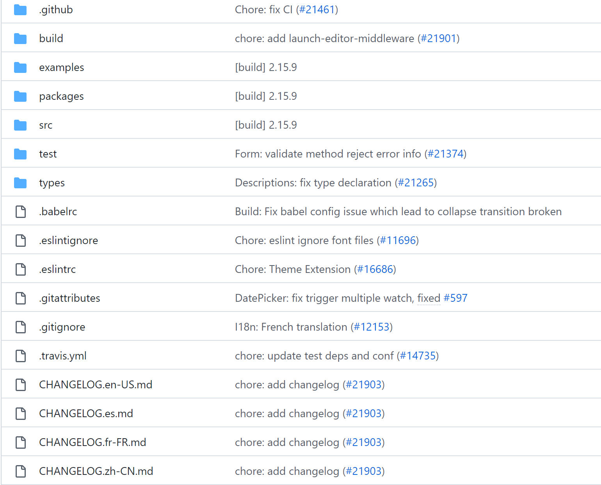
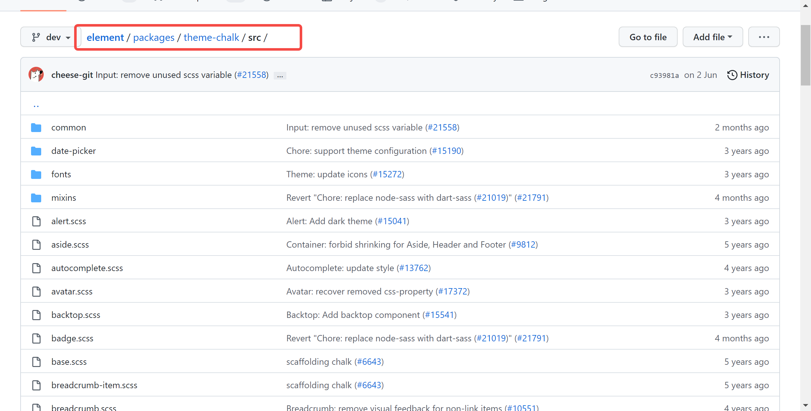
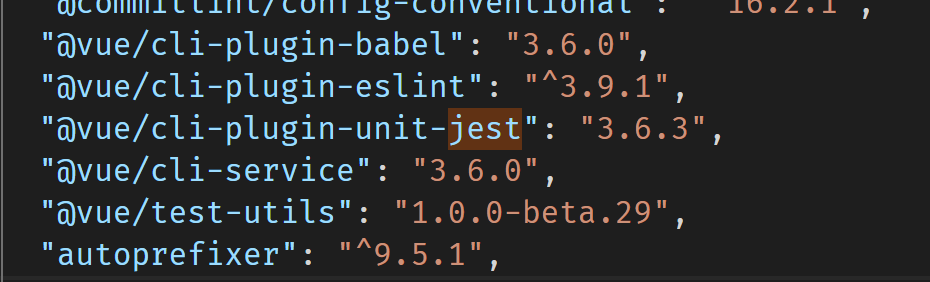
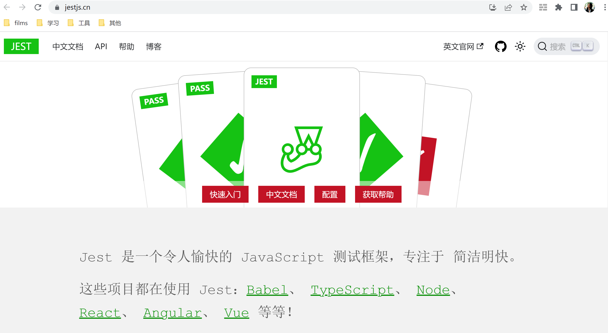
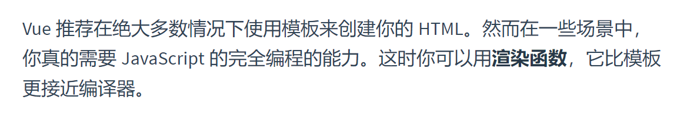

## 浅谈element ui 组件库
* element 项目结构
* 如何支持自定义主题的
* 如何做到按需引入的
* element ui工程化思想
* 以el-avatar组件为例说说render函数
* 了解Vue渲染过程
---
#### github地址：https://github.com/ElemeFE/element


---
#### 项目结构：

- build webpack编译配置文件目录
- examples element ui官方主页项目目录
- packages 各个组件的源码目录
- src 项目使用到的公共指令、工具集等源码存放目录
- test 单元测试相关
- type typescript相关文件包
  
---
组件目录通常由 index.js 和 src 组成，src 下的 vue 文件是生成组件的逻辑代码，index.js 文件是组件的注册和导出。如果有README.md文件，一般就是该组件的解释说明

---
## element ui 如何支持自定义主题的?
* element-ui 组件的样式、公共样式都在 packages/theme-chalk 文件中
* element-ui 组件样式中的颜色、字体、线条等等样式都是通过变量的方式引入的
* 只要修改这些变量，就可以方便地实现组件的主题改变
---


---
## 引入方式
### cdn
  * 优点：不需要构建工具，开箱即用
  * 缺点：全量引入了所有组件，体积非常大
### npm
 * 官方推荐的引入方式，能更好地和webpack打包工具配合使用，支持完整引入和按需引入
---
### 为什么需要按需引入？
  完整引入的组件包体积较大，项目中通常不会用到所有类型的element组件，因此会有资源的浪费

---
## 如何支持按需引入？
### 按需引入的方式
```js
import Vue from 'vue';
import { Button, Select } from 'element-ui';
import App from './App.vue';

Vue.component(Button.name, Button);
Vue.component(Select.name, Select);
/* 或写为
 * Vue.use(Button)
 * Vue.use(Select)
 */

new Vue({
  el: '#app',
  render: h => h(App)
});
```
---
### 如何支持按需引入的？
以button组件为例，当单独引入button组件时：
```js
import { Button } from 'element-ui';
```   
其实是通过webpack插件babel-plugin-component将上述代码转换成：
```js
var button = require('element-ui/lib/button')

require('element-ui/lib/theme-chalk/button.css')
```
这样就精准地引入了对应lib（打包后的文件夹）下的 Button 组件的 JS 和 CSS 代码了，也就实现了按需引入 Button 组件。

---
组件的install方法为Vue.use()提供了入口


---
## element ui工程化思想

# 什么是（前端）工程化呢？

---
* 将系统化、规范化、可度量的方法用于前端应用的开发、运行和维护过程

* 用工程化方法构建和维护有效的、实用的、高质量的前端应用

通俗理解：通过各种工具和技术或思想，提升前端开发效率的过程（标准化、组件化、模块化、自动化。。。）

---
### element ui 做了哪些前端工程化工作
* eslint
  保证代码风格/规范的基本一致性
* webpack
* 模块化
  公共模块的抽取（directives、locale、mixins、transitions、utils等）
* 测试
  使用了测试框架karma为组件编写测试

---
从我们项目package.json截的图：



---
jest官方文档：https://www.jestjs.cn/



---
### el-avatar 源码：
https://github1s.com/ElemeFE/element/blob/dev/packages/avatar/src/main.vue

### 为什么/什么情况适合使用render函数:
 https://v2.cn.vuejs.org/v2/guide/render-function.html

tips: 你可以通过使用某些插件来达到通过写jsx来写render函数的效果

---
Vue 的渲染过程

---
# 谢谢聆听✌️😄😄😊😊